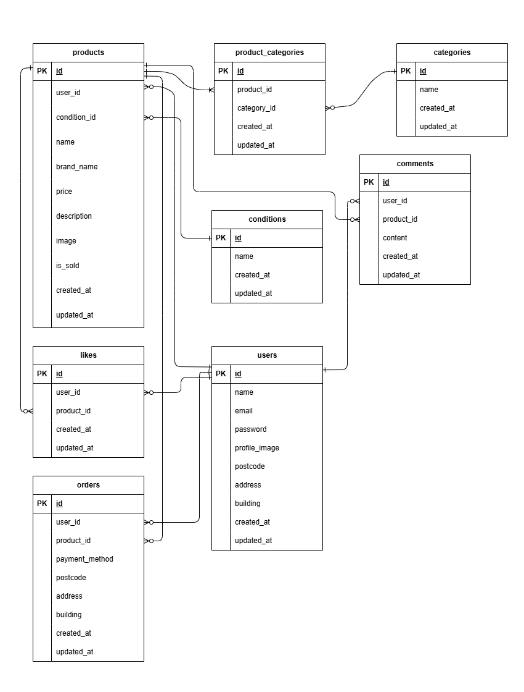

# coachtech furima

## 環境構築
### Dockerビルド
1.git clone  git@github.com:como-natsu/coachtech-furima.git  
2.cd coachtech-furima  
3.DockerDesktopアプリを立ち上げる  
4.docker-compose up -d --build  

*MySQLは、OSによって起動しない場合があるのでそれぞれのPCに合わせて docker-compose.yml ファイルを編集してください。  

### Laravel環境構築
1.docker-compose exec php bash  
2.composer install  
3..env.exampleファイルから.envを作成し、環境変数を変更
  DB_CONNECTION=mysql  
  DB_HOST=mysql  
  DB_PORT=3306  
  DB_DATABASE=laravel_db  
  DB_USERNAME=laravel_user  
  DB_PASSWORD=laravel_pass  
4.php artisan key:generate  
5.php artisan migrate  
6.php artisan db:seed  
7.php artisan storage:link  

### 注意（ブラウザアクセス時の権限エラー
*Laravel は storage と bootstrap/cache に書き込み権限が必要です。  
ブラウザでアクセスした際に権限エラーが出る場合があります。  
その場合は src/ 内で以下を実行してください。  
1.sudo chmod -R 775 storage bootstrap/cache  
2.sudo chown -R www-data:www-data storage   bootstrap/cache  
macOS やユーザー環境によっては www-data:www-data を $(whoami):$(whoami) に置き換えてください。  

## 使用技術(実行環境)
- PHP 8.4.7
- Laravel 8.83.29
- MySQL 11.8.3
- Docker 28.3.2
- Docker Compose v2.38.2

## ER図

## URL
- 開発環境：http://localhost/
- phpMyAdmin:http://localhost:8080/